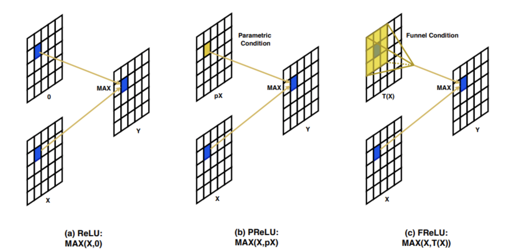
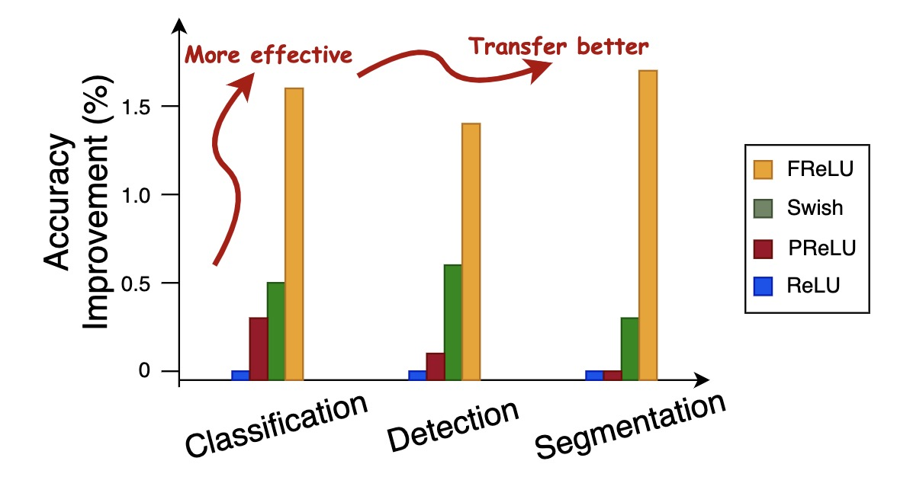
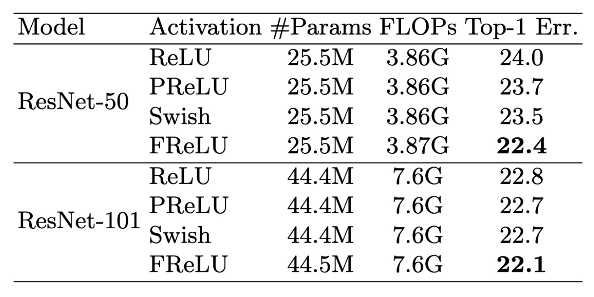
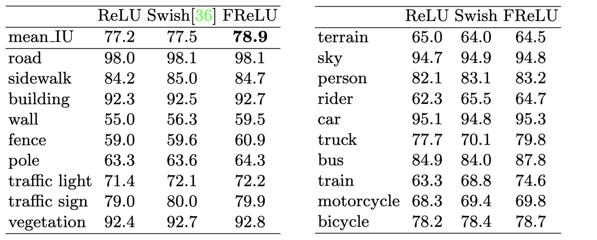

# [Funnel Activation for Visual Recognition](https://arxiv.org/abs/2007.11824)

　

# Overview
They propose simple yet effective activation function, Funnel ReLU(FReLU).  
Existing method, such as DCN can grasp the local context adaptively in image, but it is complex and not efficient. Moreover, since grasping spatial dependency and appling activation function are separated, if we apply such method, activation function don't depend on spatial conditions. But spatial dependency is important in activation function. 
FReLU is $y=max(x, T(x))$, where $T(x)$ extract spatial contextual feature. So FReLU can conducts non-linear transformation and create spatial dependencies simultaneously and $max(,)$ give per-pixel a choice between looking at the spatial context or not. 

# Novelty
1. Compared Spatial dependency modeling, such as DCN, proposed method is simple and effective. it just add depth-wise separable convolution and BN layer to each ReLU activation.
2. FReLU depend on spatial conditions explicitly. Existing method usually capture spatial dependency in convolution layer, then apply activation layer as non-linear transformation, 
so it don't depend on spatial conditions.

# Experimental result
1. Image Classification
    - dataset: ImageNet2012
    - model: ResNet50, 101
    - FReLU: replace all ReLU except last stage
    - Result: Compared Swish, it improves 1.1% and 0.6% top-1 acc on ResNet50, 101.

2. Object Detection
    - dataset: COCO2017 train/val
    - model: RetinaNet(backbone: ResNet50, ShuffleNetV2)
    - Result: Compared Swish, it improves 0.8% mAP.

3. Semantic Segmentation
    - dataset: CityScape
    - model: PSPNet(backbone: ResNet50)
    - Result: Compared Swish, it improves 1.4% mAP.

# Next paper to read

